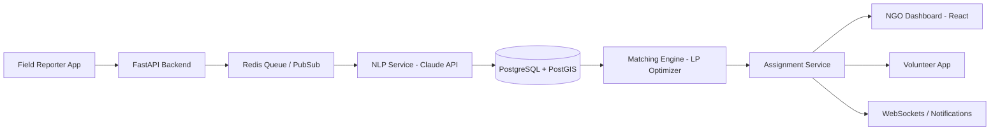

# HackTitans-Google-Solution-Challenge-2026
# 🚀 SevaaSetu

**AI-Powered Smart Resource Allocation for Social Impact**

> Bridging the gap between those in need and those who can help.

---

## 📌 Overview

**SevaaSetu** is an AI-driven, event-based platform designed to transform how NGOs coordinate volunteers during crises.

It connects:

* 📍 Ground-level intelligence (Field Reports)
* 🧠 AI-powered need analysis
* 🤝 Intelligent volunteer matching
* ✅ Verified task execution

---

## 🎯 Problem Statement

Crisis response systems today face:

* Fragmented and delayed field reports
* Lack of structured data
* Inefficient manual volunteer assignment
* Poor visibility and accountability

---

## 💡 Solution

SevaaSetu provides:

### 🔹 Need Aggregation

* Converts unstructured reports into structured insights using NLP

### 🔹 Smart Volunteer Matching

* Uses scoring models + optimization to assign the best volunteers

---

## 🧠 Key Features

* 🌍 Live geospatial dashboard (PostGIS)
* 🤖 AI-powered NLP analysis
* ⚡ Event-driven microservices architecture
* 📡 Real-time dispatch via WebSockets
* 📊 LP-based optimal matching engine
* 📱 Mobile-first user experience
* ✅ Proof-of-work verification

---

# 🏗️ Architecture

## 🔷 High-Level Architecture Diagram



---

## ⚙️ Tech Stack

| Layer        | Technology           |
| ------------ | -------------------- |
| Frontend     | React                |
| Backend      | FastAPI              |
| Database     | PostgreSQL + PostGIS |
| Cache        | Redis                |
| AI/ML        | Claude API           |
| Optimization | PuLP                 |
| Infra        | Docker               |

---

## 🧱 Design Principles

* Microservices over monolith
* Event-driven async processing
* Geospatial indexing using PostGIS
* Redis for caching + pub/sub
* Stateless JWT authentication
* Decoupled scoring and assignment engines
* LLM abstraction for flexibility

---

# 🎨 Wireframes

## 👤 Field Reporter Interface

```text
+----------------------------------+
|  Report Ground Need              |
+----------------------------------+
| 📍 Location: Auto-detected       |
|                                  |
| 📸 Upload Image                  |
| [ Capture / Upload ]             |
|                                  |
| 📝 Description                   |
| "Flooded village needs food..."  |
|                                  |
| 🤖 AI Analysis                   |
| Category: Food                   |
| Urgency: 9.2 (Critical)          |
| People: ~50                      |
|                                  |
| [ Transmit Report ]              |
+----------------------------------+
```

---

## 🧑‍💼 NGO Dashboard

```text
+------------------------------------------------------+
| 🌍 Crisis Dashboard                                 |
+------------------------------------------------------+
| 🗺️ MAP (PostGIS)                                    |
|  🔴  🔴   🟠   🔵                                   |
|                                                      |
+----------------------+------------------------------+
| Recent Reports       | Selected Report              |
|----------------------|------------------------------|
| • Flood - 50 ppl     | Category: Medical            |
| • Fire - 20 ppl      | Urgency: 8.7                 |
| • Food shortage      | Location: 3km radius         |
|                      |                              |
|                      | [ Convert to Task ]          |
+----------------------+------------------------------+
```

---

## 🙋 Volunteer Interface

```text
+----------------------------------+
| 📋 Available Missions            |
+----------------------------------+
| 🚑 Medical Aid                   |
| 📍 3 km away                     |
| ⭐ Match: 92%                    |
| 🔴 Priority: Critical            |
| [ Accept Mission ]               |
+----------------------------------+

+----------------------------------+
| 🚧 Active Mission                |
+----------------------------------+
| Location: Riverbank Area         |
| Task: Deliver supplies           |
|                                  |
| 📸 Upload Completion Photo       |
| 📝 Add Notes                     |
|                                  |
| [ Submit Proof ]                 |
+----------------------------------+
```

---

# 🔄 End-to-End Flow

## 1. Field Reporter

* Captures GPS, image, and description
* AI processes and structures data
* Report stored and displayed

## 2. NGO Coordinator

* Monitors dashboard
* Converts report into task
* Runs matching engine

## 3. Volunteer

* Receives mission
* Completes task
* Uploads proof
* Gets verified

---

## 🧮 Matching Algorithm

Score is based on:

* Skill similarity
* Distance
* Availability
* Urgency
* Historical performance

➡️ Optimized using **Bipartite Linear Programming**

---

## 🚀 Getting Started

### 🔧 Prerequisites

* Docker & Docker Compose
* Python 3.10+
* Node.js 18+
* PostgreSQL with PostGIS

---

### ⚡ Run Locally

```bash
git clone https://github.com/your-repo
cd sevaasetu

```

---

## 🌐 Services

| Service     | URL                                                      |
| ----------- | -------------------------------------------------------- |
| Frontend    | [http://localhost:3000](http://localhost:3000)           |
| Backend API | [http://localhost:8000](http://localhost:8000)           |
| API Docs    | [http://localhost:8000/docs](http://localhost:8000/docs) |

---

## 📊 Future Scope

* Offline-first mobile support
* Custom ML models
* SMS fallback system
* Advanced analytics dashboard
* Multi-NGO ecosystem

---

## 🤝 Contributors

* Team SevaaSetu
Team Leader :- Siddhi Nagapure
Member 1 :- Kartik Suryawanshi
Member 2 :- Purvesh Mali
---

## 📜 License

MIT License

---

## 💡 Final Note

> SevaaSetu enables a seamless flow from
> **ground reality → intelligent insight → optimized action → real impact**
